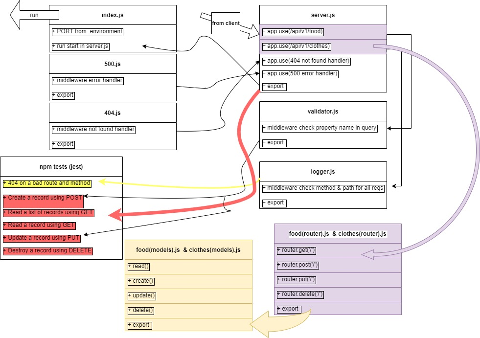

# basic-api-server

**Author: Ahmad Abu Osbeh**
<br>

- tests report
- back-end

**Setup**
<br>

- .env requirements
- PORT - 3003
- Running the app
- npm start
- Endpoint:

1- food

```
data should be:
let obj = {
type: 'banana',
color: 'yelow',
};

```

**example hit :**
[get food data](https://ahmdosbh-basic-api-server-prod.herokuapp.com/api/v1/food)

2- clothes

```
data should be:

let obj = {
type: 'T-shirt',
color: 'white',
};
http://localhost:3003/api/v1/clothes

```

**example hit :**
[get food data](https://ahmdosbh-basic-api-server-prod.herokuapp.com/api/v1/clothes)

- Returns : json with requested data

```

{
"domain": "https://ahmdosbh-basic-api-server-prod.herokuapp.com/",
"status": "running",
"port": 3003
}

```

# PR link

[PR link](https://github.com/Ahmad-AbuOsbeh/basic-api-server/pull/1)

**Tests**

**using supertest and jest**

- Unit Tests: npm run test

# UML

<br>



```

```

```

```
